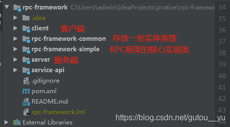

# rpc-framework

> [详细解析已经更新在了我的博客](https://blog.csdn.net/gutou__yu/category_10410898.html)

## 前言

自己动手造个轮子，通过这个简易的轮子，可以学到 RPC 的底层原理和原理以及各种 Java 编码实践的运用。

## 介绍

 [rpc-framework](https://github.com/lmgty/rpc-framework) 是一款基于 Netty+Kyro+Zookeeper 实现的 RPC 框架。


**设计思路**

### 一个基本的 RPC 框架设计思路

#### 架构
一个最简单的 RPC 框架使用示意图如下图所示,这也是这个项目目前的架构 ：


#### 工作流程
1. 服务端将服务注册到注册中心并且在服务端监听客户端请求。
2. 客户端在消费中心拿到服务，远程调用服务（发送一个request给服务端）。
3. 服务端根据request，调用对应的服务并将结果返回给客户端。
4. 客户端接收response，结束调用。

#### 技术选型
Netty + kryo + zookeeper
* Netty：网络应用框架，使用它来进行网络传输。
* kryo：序列化/反序列化工具。
* zookeeper：做注册中心。：负载均衡也是需要的。为啥？举个例子我们的系统中的某个服务的访问量特别大，我们将这个服务

#### 项目骨架


## 使用
下载运行 zookeeper。

### 服务端
发布服务：
```java
@ComponentScan("com.yufa.xz.ly")
public class NettyServerMain {
    public static void main(String[] args) {
        AnnotationConfigApplicationContext applicationContext = new AnnotationConfigApplicationContext(NettyServerMain.class);
        NettyServer nettyServer = applicationContext.getBean(NettyServer.class);
        HelloService helloService2 = new HelloServiceImpl();
        RpcServiceProperties rpcServiceProperties = RpcServiceProperties.builder()
                .group("test2").version("version2").build();
        nettyServer.registerService(helloService2, rpcServiceProperties);
        nettyServer.start();
    }
}

```

### 客户端
调用服务：
```java
public class NettyClientMain {
    public static void main(String[] args) throws InterruptedException {
        ClientTransport rpcClient = new NettyClientTransport();
        RpcServiceProperties rpcServiceProperties = RpcServiceProperties.builder()
                .group("test2").version("version2").build();

        RpcClientProxy rpcClientProxy = new RpcClientProxy(rpcClient, rpcServiceProperties);
        HelloService helloService = rpcClientProxy.getProxy(HelloService.class);
        String result = helloService.hello(new Hello("111", "222"));
        System.out.println(result);

        Thread.sleep(5000);
        for (int i = 0; i < 10; i++) {
            result = helloService.hello(new Hello("111", " i = " + i));
            System.out.println(result);
        }
    }
}
```